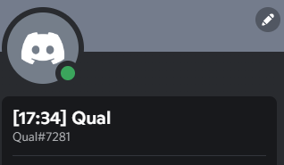

# Discord Guild Nickname Changer
## Preview
This script changes your nick on Discord server for every X seconds to 
**[`hour`:`minute`] `your_nickname`**

## Using
1. _(Optional)_ Put your [token](https://linuxhint.com/get-discord-token/#:~:text=Discord%20tokens%20act%20as%20an,full%20access%20to%20their%20accounts.) in `token.txt`
2. _(Optional)_ Put server ID into `guild.txt`
3. Run `main.py`
4. Enter delay (**60+ seconds**)
5. Enjoy your nickname!

## Errors
- If you get an error like - `Change nickname - 429` means that you send requests too fast

- If you get an error like - `Change nickname - 401` means that you enter an invalid token

- If you get an error like - `Change nickname - 404` means that you enter an invalid server ID